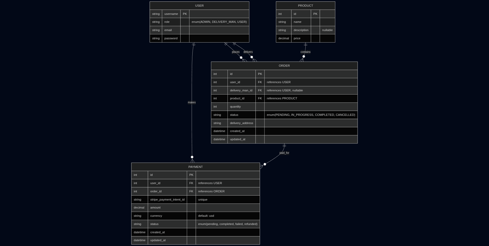

# Courier Management System — Backend API

## 📄 Project Overview
A scalable RESTful backend API for a Courier Management System. The system supports multiple roles and allows users to place and track orders, delivery men to manage assigned orders, and admins to manage the entire system.

### **Features**
- JWT-based authentication (register, login, profile update)
- Role-based access: Admin, Delivery Man, User
- Order management (create, assign, update, track)
- Stripe payment integration 

## 👥 Roles
| Role         | Permissions                                                                 |
|--------------|-----------------------------------------------------------------------------|
| Admin        | Full access: manage users, orders, assign delivery men                      |
| Delivery Man | View/update only their assigned orders status                               |
| User         | Register, login, create orders, view/track own orders (pending/delivered/complete) |

## 🔑 Authentication
- JWT-based authentication
- User registration and login
- Profile update

## 📦 Order Management
- Users create/view their own orders and check status
- Delivery men view/update only their assigned orders
- Admin views all orders and assigns delivery men

## 💳 Payment
- Users pay for delivery via Stripe 

## 🔗 Relation Diagram
> 


## Prerequisites

Before setting up the project, ensure you have the following installed:

- **Python**: Version 3.12.3
- **Virtualenv**: For creating isolated Python environments
- **Git**: For cloning the repository
- **Stripe Account**: To obtain API keys for payment processing

## Installation

Follow these steps to set up the project locally:

1. **Clone the Repository**:
   ```bash
   git clone https://github.com/imsnto/Courier-Management-System-Backend-API.git
   cd Courier-Management-System-Backend-API
   ```

2. **Create and Activate a Virtual Environment**:
   ```bash
   python3 -m venv venv
   source .venv/bin/activate  # On Windows: .venv\Scripts\activate
   ```

3. **Install Dependencies**:
   Ensure you have a `requirements.txt` file with the necessary packages (e.g., `django`, `django-cors-headers`, `stripe`). Install them using:
   ```bash
   pip install -r requirements.txt
   ```

4. **Set Up Environment Variables**:
   Create a `.env` file in the project root directory and add the following variables:
   ```env
   STRIPE_SECRET_KEY=your_stripe_secret_key
   STRIPE_PUBLISHABLE_KEY=your_stripe_publishable_key
   ```
   Replace `your_stripe_secret_key` and `your_stripe_publishable_key` with your actual Stripe API keys, obtainable from your [Stripe Dashboard](https://dashboard.stripe.com).

5. **Apply Database Migrations**:
   Run the following commands to set up the database:
   ```bash
   python manage.py makemigrations
   python manage.py migrate
   ```

6. **Create a Superuser (Optional)**:
   To access the Django admin panel, create a superuser:
   ```bash
   python manage.py createsuperuser
   ```

## Running the Application Locally

To run the application on your local machine:

1. **Start the Development Server**:
   ```bash
   python manage.py runserver
   ```
   The application will be available at `http://127.0.0.1:8000`.

2. **Access the Admin Panel**:
   Open `http://127.0.0.1:8000/admin/` in your browser and log in with the superuser credentials.

## Deployment

The application is deployed on Render at the following URL:
- **Production URL**: [https://courier-management-system-backend-api-53k6.onrender.com](https://courier-management-system-backend-api-53k6.onrender.com)

### Deployment Configuration

To deploy on Render or a similar platform, ensure the following settings in `settings.py`:

```python
ALLOWED_HOSTS = [
    'courier-management-system-backend-api-53k6.onrender.com',
    '127.0.0.1',
]

CSRF_TRUSTED_ORIGINS = [
    'https://courier-management-system-backend-api-53k6.onrender.com',
]

SECURE_SSL_REDIRECT = True
SESSION_COOKIE_SECURE = True
CSRF_COOKIE_SECURE = True

DEBUG = False  # Set to False in production
```

- **Environment Variables**: Add `STRIPE_SECRET_KEY` and `STRIPE_PUBLISHABLE_KEY` to Render’s environment variables via the Render dashboard.
- **Dependencies**: Ensure `requirements.txt` is up-to-date and includes all necessary packages.

## 🔗 Links
- **Live API URL:** [LIVE_API_URL_HERE](https://courier-management-system-backend-api-53k6.onrender.com)
- **Postman Collection:** [Postman Collection](docs/Courier-Service.postman_collection.json)


## 📝 API Endpoints
### Accounts
- `POST /api/v1/auth/register/` — Register new user
- `POST /api/v1/auth/login/` — Login
- `GET /api/v1/auth/profile/` — Get user profile
- `PUT /api/v1/auth/profile/` — Update user profile

### Orders
- `POST /api/v1/orders/` — Create order (User)
- `GET /api/v1/orders/` — List own orders (User), all orders (Admin), assigned orders(Delivery Man)
- `GET /api/v1/orders/{id}/` — Get order details
- `PUT /api/v1/orders/{id}/` — Update order (Delivery Man/Admin)

### Payments
- `POST /api/v1/payments/create-checkout-session/` — Make payment (Stripe)
- `GET /api/v1/payments/success/` —  Success Page (Stripe)
- `GET /api/v1/payments/failed/` —  Failed Page (Stripe)
